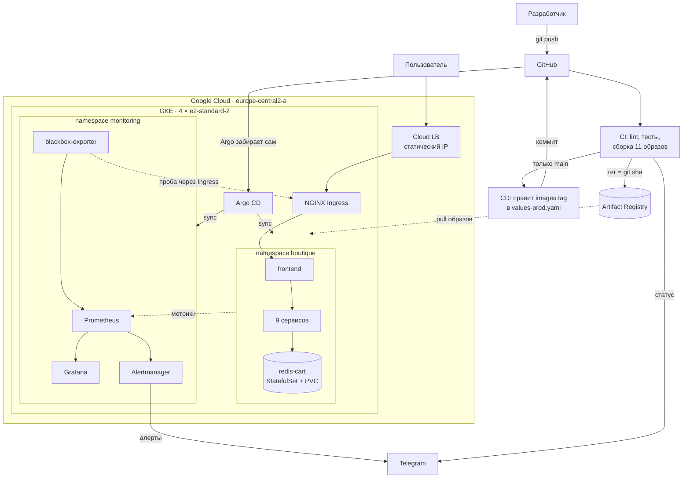
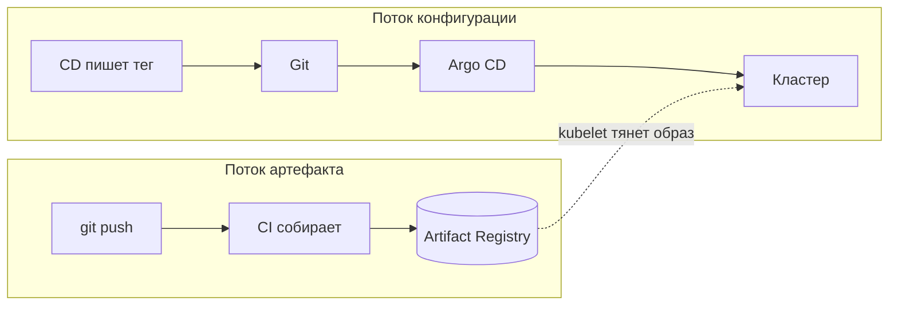

# Online Boutique в Managed Kubernetes

Микросервисное приложение из одиннадцати сервисов, развёрнутое в GKE.
Инфраструктура описана Terraform, упаковка — Helm, доставка — Argo CD,
мониторинг — Prometheus и Grafana, уведомления — Telegram.

Форк `GoogleCloudPlatform/microservices-demo`: приложение и его Helm chart
взяты оттуда, всё остальное написано с нуля.

## Архитектура



Ключевой принцип: **пайплайны не имеют доступа к кластеру.** CI кладёт
образ в реестр, CD правит тег в репозитории, состояние кластера приводит к
описанному в Git только Argo CD.



## Содержимое

| Каталог | Назначение |
|---|---|
| `src/`, `protos/` | Исходники микросервисов и gRPC-контракты (из upstream) |
| `infra/terraform/` | VPC, GKE, Artifact Registry, Workload Identity Federation, статический IP |
| `deploy/helm/onlineboutique/` | Helm chart приложения |
| `deploy/argocd/` | Application для Argo CD |
| `deploy/monitoring/` | Правила алертинга, дашборд Grafana, проба blackbox |
| `deploy/secrets/` | Шаблоны секретов без значений |
| `deploy/certs/` | ClusterIssuer Let's Encrypt |
| `scripts/` | `bootstrap.sh`, `teardown.sh`, `port-forward.sh` |
| `docs/` | `architecture.md`, `runbook.md` |
| `.github/workflows/` | `ci.yaml`, `cd.yaml` |
| `docker-compose.yml` | Локальный запуск без Kubernetes |
| `.env.example` | Образец локальных настроек |

## Требования

`gcloud`, `terraform`, `kubectl` с `gke-gcloud-auth-plugin`, `helm`,
`docker`, `envsubst`, `openssl`. Желательно `gh` — без него после полного
удаления некому пересобрать образы. Проект GCP с привязанным биллингом.

## Развёртывание

Аутентификация выполняется вручную — автоматизировать её нельзя, она
подтверждает личность человека:

```bash
gcloud auth login && gcloud auth application-default login
gcloud billing projects link <проект> --billing-account=<ID>
```

Настройки стенда — в `.env` (в git не попадает):

```bash
cp .env.example .env
```

Обязательны `PROJECT_ID`, `TELEGRAM_TOKEN` и `TELEGRAM_CHAT_ID`. Токен
получают у `@BotFather`, идентификатор чата — через
`https://api.telegram.org/bot<ТОКЕН>/getUpdates` после первого сообщения
боту. Без них скрипт останавливается на проверках, не создавая ресурсов:
Alertmanager не поднимется без конфигурации, а уведомления — часть
требований к системе.

Дальше одной командой:

```bash
./scripts/bootstrap.sh
```

Скрипт выполняет проверки окружения, создаёт бакет под состояние Terraform,
восстанавливает объекты IAM после предыдущего удаления, применяет Terraform,
получает kubeconfig, создаёт секреты кластера, разворачивает Argo CD, стек
мониторинга и NGINX Ingress, регистрирует Application, поднимает проброску
портов и печатает адреса.

Если Artifact Registry пуст — так бывает после полного удаления, потому что
образы живут вместе с реестром, — скрипт запускает сборку в CI и дожидается
её, чтобы стенд поднялся на собственных образах, а не на публичных.

Повторный запуск идемпотентен: существующие ресурсы не пересоздаются,
сгенерированные пароли не перезаписываются.

## Сборка и доставка

Пуш в любую ветку запускает CI: hadolint, `helm lint`, `terraform fmt` и
`validate`, `go test` и `dotnet test`, сборка одиннадцати образов,
публикация их в Artifact Registry с тегом, равным git sha, и публикация
Helm chart в OCI-репозиторий. Результат приходит в Telegram.

Пуш в `main` после успешного CI запускает CD: он обновляет `images.tag`
в `deploy/helm/onlineboutique/values-prod.yaml` и коммитит изменение.
Кластер приводит к состоянию из Git только Argo CD; доступа к кластеру у
пайплайнов нет.

## Откат

```bash
argocd app set boutique --sync-policy none      # иначе откат отклоняется
argocd app history boutique
argocd app rollback boutique <номер ревизии>
```

Argo CD не выполняет откат при включённой автосинхронизации: она сразу
вернула бы состояние из Git. После отката приложение остаётся `OutOfSync`
— кластер на старой версии, Git на новой.

Вернуть соответствие можно двумя способами. Включить автосинхронизацию
обратно, и тогда кластер догонит Git:

```bash
argocd app set boutique --sync-policy automated --auto-prune --self-heal
```

Либо откатить сам Git, если проблема в выкаченной версии:

```bash
git revert <коммит> && git push
```

## Мониторинг

`kube-prometheus-stack` собирает метрики нод, объектов Kubernetes и
контейнеров. Доступность и время ответа витрины снимаются отдельно —
blackbox-экспортер раз в полминуты запрашивает её через Ingress Controller,
то есть тем же путём, что и пользователь.

Так сделано потому, что сервисы приложения инструментированы OpenTelemetry
и не отдают `/metrics` в формате Prometheus, а `ingress-nginx` 1.15 больше
не собирает подробные метрики запросов. Проба вместо этого проверяет весь
тракт целиком: отказ любого бэкенда виден снаружи, даже когда под
`frontend` жив.

| Алерт | Условие | Выдержка |
|---|---|---|
| `BoutiquePodNotReady` | под не в состоянии Ready | 5 мин |
| `BoutiqueFrontendDown` | `probe_success == 0` | 2 мин |
| `BoutiqueHighLatency` | ответ дольше секунды | 5 мин |

Выдержка у каждого правила отсекает штатные события: во время обновления
образа часть подов законно не готова, и без неё алерты срабатывали бы на
каждом деплое.

Уведомления идут в Telegram — туда же, куда результаты сборки, поэтому вся
история стенда собрана в одном месте.

## Доступ к интерфейсам

Наружу опубликовано только приложение — через Ingress с сертификатом
Let's Encrypt:

| Что | Адрес |
|---|---|
| Витрина | `https://<адрес>.nip.io` |

Служебные интерфейсы публичного адреса не имеют. У Prometheus и
Alertmanager нет собственной аутентификации, а веб-интерфейс Alertmanager
позволяет заглушать алерты, поэтому доступ к ним идёт через туннель,
видимый только владельцу kubeconfig:

```bash
./scripts/port-forward.sh start
```

| Что | Адрес |
|---|---|
| Argo CD | `http://localhost:8081` |
| Grafana | `http://localhost:3000` |
| Prometheus | `http://localhost:9090` |
| Alertmanager | `http://localhost:9093` |

Туннели поднимаются автоматически в конце `bootstrap.sh`. Управление —
`./scripts/port-forward.sh status` и `stop`.

Пароли:

```bash
kubectl -n argocd get secret argocd-initial-admin-secret -o jsonpath='{.data.password}' | base64 -d
```

```bash
kubectl -n monitoring get secret grafana-admin -o jsonpath='{.data.admin-password}' | base64 -d
```

Пароль Grafana генерируется при первом развёртывании и печатается в конце
работы `bootstrap.sh`.

## Удаление

```bash
./scripts/teardown.sh
```

Скрипт снимает Argo CD, Service типа LoadBalancer и PersistentVolumeClaim
до `terraform destroy`: эти ресурсы создаёт Kubernetes, в состоянии
Terraform их нет, и при обратном порядке в проекте остаются
тарифицируемые диски и правила переадресации. В конце выводятся
контрольные списки ресурсов.

## Секреты

В репозитории секретов нет. Пайплайны обращаются к GCP через Workload
Identity Federation, ключи сервисных аккаунтов не создаются. Kubeconfig
получается через `gcloud container clusters get-credentials` и не хранится
в git. Секреты кластера создаёт `bootstrap.sh`: пароли генерируются при первом
развёртывании и не перезаписываются при повторных, конфигурация
Alertmanager собирается из шаблона `deploy/secrets/alertmanager.tmpl.yaml`
с подстановкой токена бота из `.env`. Файл `.env` в git не попадает,
образец — `.env.example`.
