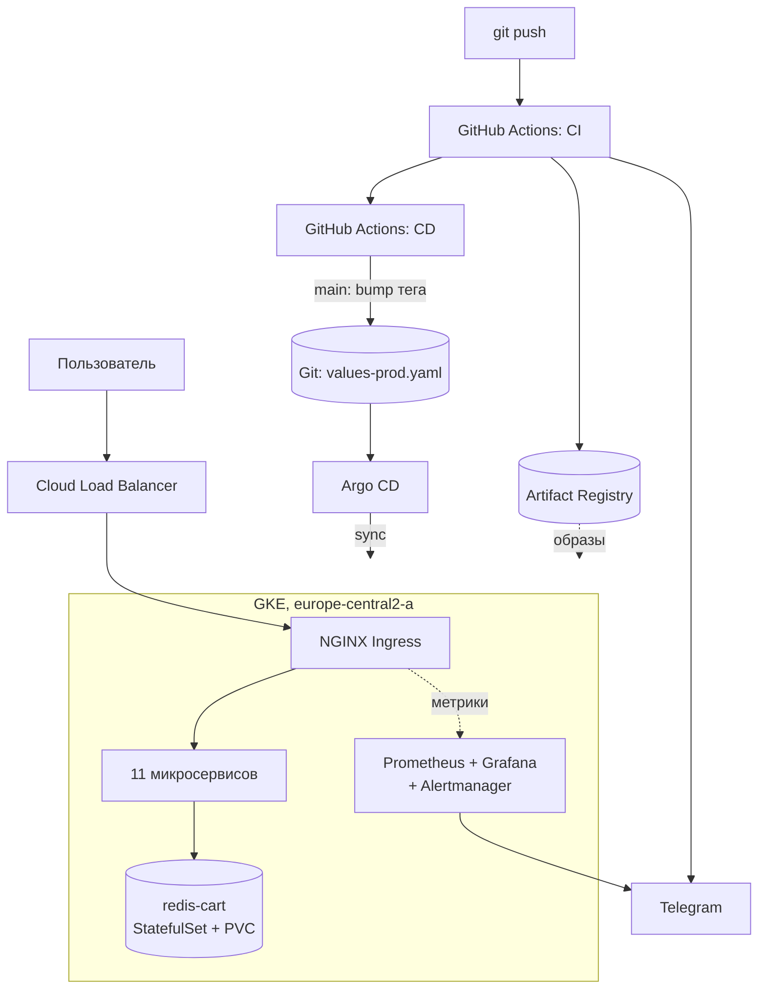

# Архитектура

## Приложение

Online Boutique — интернет-магазин из одиннадцати микросервисов, связанных
по gRPC. Копия `GoogleCloudPlatform/microservices-demo`, upstream сохранён
как одноимённый remote.

| Сервис | Язык | Порт | Назначение |
|---|---|---|---|
| frontend | Go | 8080 | HTTP-витрина |
| productcatalogservice | Go | 3550 | Каталог |
| cartservice | C# | 7070 | Корзина |
| checkoutservice | Go | 5050 | Оформление заказа |
| shippingservice | Go | 50051 | Расчёт доставки |
| paymentservice | Node.js | 50051 | Оплата |
| emailservice | Python | 8080 | Письма |
| currencyservice | Node.js | 7000 | Конвертация валют |
| recommendationservice | Python | 8080 | Рекомендации |
| adservice | Java | 9555 | Баннеры |
| loadgenerator | Python | — | Синтетическая нагрузка |
| redis-cart | — | 6379 | Хранилище корзин |

`shoppingassistantservice` из `src/` не собирается и не разворачивается:
он отсутствует в чарте и манифестах и требует ключа Gemini API.

## Схема



Образы публикуются в registry, конфигурация — в Git. Сводит их Argo CD.
CI доступа к кластеру не имеет: у сервисного аккаунта `boutique-ci`
единственная роль `roles/artifactregistry.writer`, `kubectl apply` в
пайплайнах не выполняется.

## Инфраструктура

Terraform, состояние в GCS с версионированием.

| Модуль | Ресурсы |
|---|---|
| `network` | VPC, подсеть, вторичные диапазоны под поды и сервисы |
| `gke` | Кластер, пул нод, service account нод |
| `registry` | Artifact Registry, формат Docker |
| `wif` | Workload Identity Pool, OIDC-провайдер, service account CI |

Принятые решения:

- **Зональный кластер.** Дешевле регионального, не тарифицируется плата за
  управление. Отказоустойчивость на уровне зоны отсутствует.
- **Dataplane V2.** NetworkPolicy без установки Calico. С устаревшим блоком
  `network_policy` несовместим.
- **Отдельный service account нод** вместо Compute Engine default SA с
  ролью Editor на весь проект. Выдано пять минимальных ролей.
- **Workload Identity Federation** вместо ключа сервисного аккаунта. Доверие
  ограничено одним репозиторием через `attribute.repository`.
- **`disable_on_destroy = false`** у включаемых API: проект используется и
  под другие задачи.

## Данные

`redis-cart` развёрнут как StatefulSet с `volumeClaimTemplates`,
StorageClass `standard-rwo`, том 8 ГиБ. В upstream это Deployment с
`emptyDir`. Режим переключается через
`cartDatabase.inClusterRedis.persistence.enabled`.

## Мониторинг

kube-prometheus-stack, развёрнут через Argo CD.

Источники метрик выбраны по факту наличия. Приложение не отдаёт
`/metrics`: в сервисы встроен OpenTelemetry. NGINX Ingress версии 1.15
больше не собирает подробные метрики запросов — остался только процессный
счётчик без разбивки по кодам ответа и без гистограммы задержек.

Поэтому доступность и время ответа снимаются пробами blackbox exporter:
он обращается к витрине через Ingress Controller, тем же путём, что и
пользователь. Состояние подов берётся из kube-state-metrics, нагрузка —
из процессного счётчика Ingress.

Компоненты `kubeControllerManager`, `kubeScheduler`, `kubeEtcd`, `kubeProxy`
выключены — в GKE control plane управляется провайдером и метрики с него
недоступны.

Алерты: `BoutiquePodNotReady`, `BoutiqueFrontendDown`,
`BoutiqueHighLatency`.

## Структура репозитория

```text
├── docker-compose.yml              локальный запуск
├── infra/terraform/                VPC, GKE, registry, WIF
│   └── modules/                    network, gke, registry, wif
├── deploy/
│   ├── helm/onlineboutique/        чарт приложения
│   ├── argocd/                     Application
│   └── monitoring/                 PrometheusRule, Probe, дашборд,
│                                   конфигурация Alertmanager
├── scripts/
│   ├── bootstrap.sh                развёртывание
│   └── teardown.sh                 удаление
├── .github/workflows/
│   ├── ci.yaml                     lint, тесты, сборка, публикация
│   └── cd.yaml                     обновление тега на main
├── src/                            исходники сервисов
└── docs/
```
