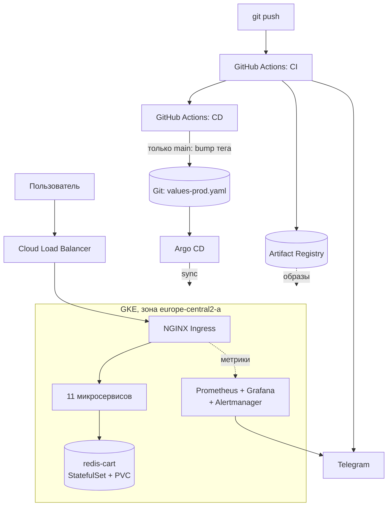

# Архитектура

## Приложение

Online Boutique — демонстрационный интернет-магазин Google из одиннадцати
микросервисов, общающихся по gRPC. Копия репозитория
`GoogleCloudPlatform/microservices-demo`; upstream сохранён как remote
`upstream`, поэтому происхождение кода проверяемо.

| Сервис | Язык | Порт | Роль |
|---|---|---|---|
| frontend | Go | 8080 | HTTP-витрина, единственный сервис с веб-интерфейсом |
| productcatalogservice | Go | 3550 | Каталог товаров |
| cartservice | C# | 7070 | Корзина, единственный сервис с состоянием |
| checkoutservice | Go | 5050 | Оформление заказа, оркестрирует остальные |
| shippingservice | Go | 50051 | Расчёт доставки |
| paymentservice | Node.js | 50051 | Имитация оплаты |
| emailservice | Python | 8080 | Имитация писем |
| currencyservice | Node.js | 7000 | Конвертация валют |
| recommendationservice | Python | 8080 | Рекомендации |
| adservice | Java | 9555 | Баннеры |
| loadgenerator | Python/Locust | — | Синтетическая нагрузка |
| redis-cart | — | 6379 | Хранилище корзин |

Двенадцатый сервис из `src/`, `shoppingassistantservice`, намеренно не
собирается и не разворачивается: он не входит ни в Helm chart, ни в
манифесты upstream и требует ключа к Gemini API.

## Схема



## Ключевое свойство: два раздельных потока

**Образ** едет в registry. **Конфигурация** едет в Git. Пересекаются они
только внутри кластера, и сводит их Argo CD.

CI не имеет и не должен иметь доступа к кластеру: у сервисного аккаунта
`boutique-ci` единственная роль — `roles/artifactregistry.writer`.
`kubectl apply` из пайплайна не выполняется нигде. Поэтому утечка
CI-креденшелов не даёт власти над кластером, а состояние кластера всегда
описано в Git и воспроизводимо.

## Инфраструктура

Terraform, разбитый на модули, состояние в GCS с версионированием.

| Модуль | Что создаёт |
|---|---|
| `network` | VPC, подсеть, вторичные диапазоны под поды и сервисы |
| `gke` | Кластер, пул нод, отдельный service account для нод |
| `registry` | Artifact Registry в формате Docker |
| `wif` | Workload Identity Pool, OIDC-провайдер, SA для CI |

Решения, которые стоит объяснить:

**Зональный кластер, а не региональный.** За один зональный кластер Google
не берёт плату за управление, и нод нужно втрое меньше. Плата — отсутствие
отказоустойчивости на уровне зоны, что для учебного стенда приемлемо.

**Dataplane V2 вместо legacy network policy.** Даёт NetworkPolicy нативно,
без установки Calico, и не конфликтует с устаревшим блоком `network_policy`.

**Отдельный service account для нод.** По умолчанию GKE выдаёт нодам
Compute Engine default SA с ролью Editor на весь проект. Проект здесь общий
с другими задачами, поэтому нодам выданы пять минимальных ролей.

**Workload Identity Federation вместо ключа сервисного аккаунта.** GitHub
Actions обменивает свой OIDC-токен на короткоживущий токен GCP. JSON-ключа
не существует, значит его нельзя потерять или закоммитить. Доверие сужено
до конкретного репозитория через `attribute.repository`.

**`disable_on_destroy = false` у включаемых API.** Проект переиспользуется
под другие задачи; выключение `compute` или `container` на `terraform
destroy` сломало бы чужие ресурсы.

## Данные и персистентность

В upstream `redis-cart` — это Deployment с `emptyDir`, и корзина теряется
при каждом пересоздании пода. Здесь он переведён в StatefulSet с
`volumeClaimTemplates`, StorageClass `standard-rwo` (это `pd-balanced`
в GKE), том 8 ГиБ.

Переключатель `cartDatabase.inClusterRedis.persistence.enabled` оставлен
намеренно: он позволяет показать оба состояния и продемонстрировать
разницу, а не рассказывать о ней.

## Мониторинг

kube-prometheus-stack, развёрнутый через Argo CD, а не helm-командой.

Метрики ошибок и задержки снимаются с NGINX Ingress. Причина: Online
Boutique не отдаёт `/metrics` — в сервисы зашит OpenTelemetry, а не
Prometheus-экспортер. Ingress пропускает через себя весь пользовательский
трафик, поэтому даёт и RPS, и коды ответов, и время ответа. Состояние
подов берётся из kube-state-metrics.

Компоненты `kubeControllerManager`, `kubeScheduler`, `kubeEtcd` и
`kubeProxy` в чарте выключены: в managed-кластере control plane принадлежит
Google и метрики с него недоступны. Оставить их включёнными — получить
постоянно красные targets.

## Структура репозитория

```text
├── docker-compose.yml              локальный запуск без Kubernetes
├── infra/terraform/                IaC: VPC, GKE, registry, WIF
│   └── modules/                    network, gke, registry, wif
├── deploy/
│   ├── helm/onlineboutique/        чарт приложения (+ Ingress, + PVC)
│   ├── argocd/                     Application: приложение, мониторинг, правила
│   └── monitoring/rules/           PrometheusRule с алертами
├── scripts/
│   ├── bootstrap.sh                подъём стенда одной командой
│   └── teardown.sh                 снос с проверкой остатков
├── .github/workflows/
│   ├── ci.yaml                     lint, тесты, сборка, публикация
│   └── cd.yaml                     bump тега в Git на main
├── src/                            исходники микросервисов
└── docs/                           architecture.md, runbook.md
```
